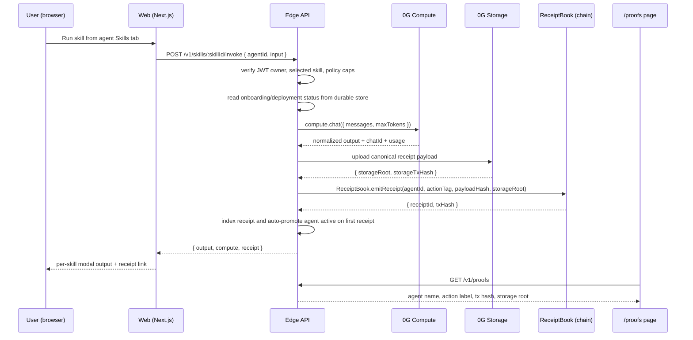
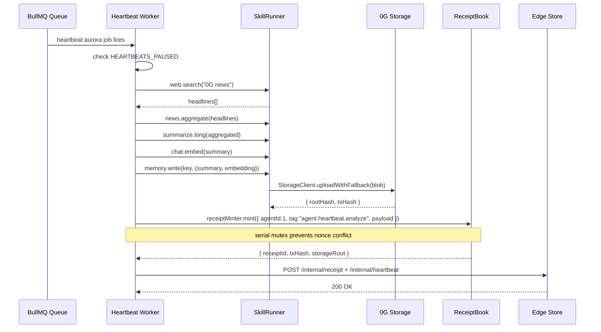
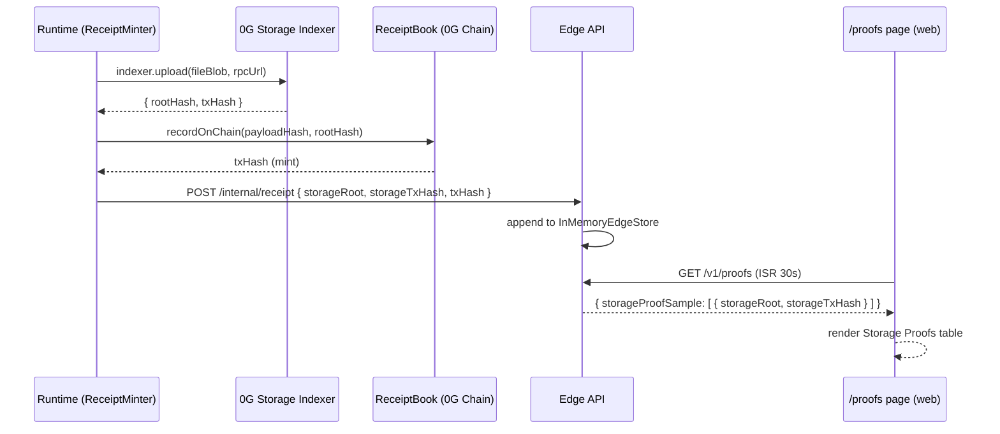
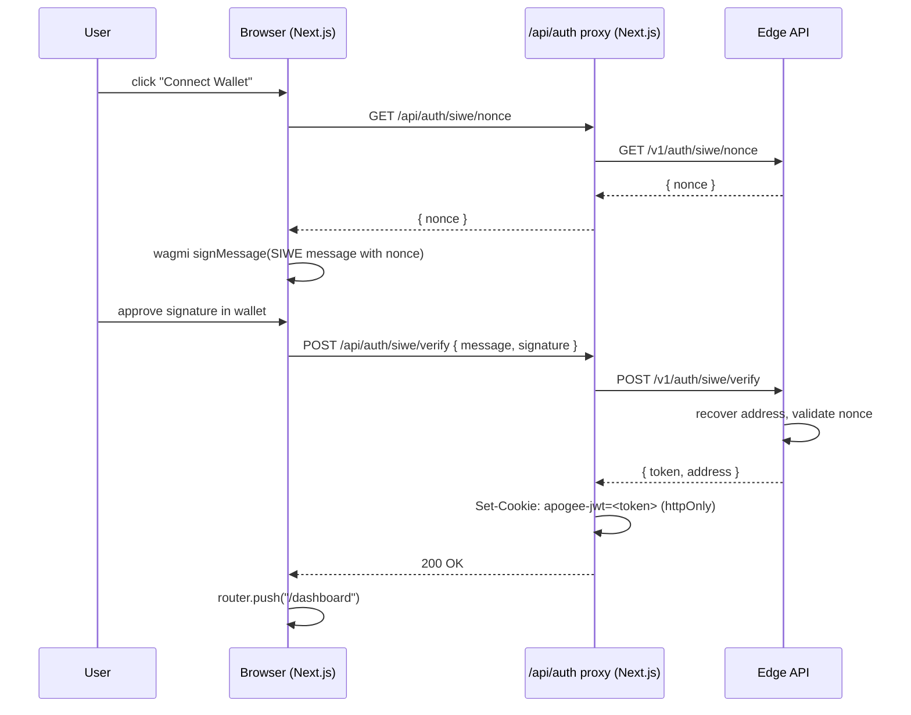

# Apogee Protocol — Architecture

## 1. System Overview

Apogee is a four-layer autonomous-agent runtime:

```
┌─────────────────────────────────────────────────────────────┐
│  Layer 4 — User Interface                                    │
│  Next.js 14  ·  SIWE auth  ·  Dashboard  ·  /proofs page    │
└────────────────────────┬────────────────────────────────────┘
                         │ HTTPS / WS
┌────────────────────────▼────────────────────────────────────┐
│  Layer 3 — Edge API                                          │
│  Fastify 5  ·  JWT  ·  BullMQ  ·  Prisma/PostgreSQL          │
│  /v1/agents  /v1/skills  /v1/quote  /v1/receipts  /v1/ws     │
└──────────────┬────────────────────────┬────────────────────┘
               │                        │
┌──────────────▼──────────┐  ┌──────────▼────────────────────┐
│  Layer 2 — Runtime      │  │  Layer 1 — 0G Primitives       │
│  BullMQ heartbeat workers│  │                               │
│  SkillRunner (isolate)  │  │  0G Chain  (EVM, chainId 16661)│
│  ReceiptMinter (mutex)  │  │  0G Storage (indexer SDK)      │
│  Reconciler (60s retry) │  │  0G Compute (serving-broker)   │
│  MemoryEngine           │  │  0G DA (planned)               │
└─────────────────────────┘  └────────────────────────────────┘
```

## 2. Component Interaction Diagrams

### 2.1 Agent Skill Execution (dashboard skill call)



Production live skills are `chat.completion`, `text.summarize`, `text.translate`, `text.sentiment`, `text.entities`, `text.keywords`, `text.rewrite`, `text.title`, and `code.review`. The modal renderer consumes canonical Edge output shapes (`output.content`, `output.summary`, `output.translation`, `output.sentiment`, `output.entities`/`output.keywords`, `output.rewrite`, `output.title`, `output.review`) and falls back to raw JSON only for malformed outputs.


### 2.2 Apogee Pilot inference and receipts

Apogee Pilot is exposed both as the floating in-app launcher and as the full-page `/apogee-pilot` chat surface. The browser posts to `apps/web` at `/api/pilot/chat`; the Next.js route runs on the Node.js runtime and forwards the stream plus the `apogee-jwt` cookie as a Bearer token to Edge `/v1/pilot/chat` without buffering. The route uses the configured `PILOT_AGENT_PRIVATE_KEY` service wallet identity for unauthenticated widget receipt payloads and mints indexed `pilot.chat` receipts through the authorized Edge relayer.

Edge serves Pilot with a three-tier inference strategy:

1. **0G Compute primary** — `@apogee/compute-client.chat({ messages, stream: true })`; model selection is left to the configured provider/default metadata.
2. **HTTP LLM fallback** — existing `PILOT_LLM_BASE_URL` / `PILOT_LLM_API_KEY` OpenAI-compatible stream, also used when `APOGEE_PILOT_USE_COMPUTE=false`.
3. **Simulated fallback** — deterministic `simulatePilotTokens()` responses when both live inference paths are unavailable.

Every completed Pilot chat can mint a non-blocking ReceiptBook receipt with indexed action label `pilot.chat` (encoded as bytes4 `pilo` on-chain). Authenticated requests use the user wallet address in the receipt payload; unauthenticated widget requests use the configured `PILOT_AGENT_PRIVATE_KEY` service wallet identity. Pilot is not an agent iNFT, so receipts use `agentId=0` as a system sentinel; `ReceiptBook.emitReceipt` permits this and existing system contracts already emit `agentId=0` receipts. If a client cancels after tokens have streamed, Edge mints the same receipt payload with `cancelled: true`; zero-token aborts do not mint. Conversation history remains bounded in-memory LRU state on Edge.

### 2.3 Heartbeat Loop (Aurora — every 10 min)



### 2.4 Storage Proof Path



### 2.5 SIWE Authentication Flow



## 3. Data Flow — Receipt Lifecycle

The on-chain `ReceiptBook` stores compact receipt fields, including a bytes4 action tag. Edge keeps the richer indexed metadata used by the product UI: full action labels such as `text.summarize`, agent display names such as `Francc Alpha`, storage transaction hashes, and normalized skill outputs. `/proofs` reads this Edge metadata and links only real 32-byte transaction hashes to Chainscan, which is why the UI can display full skill names even though on-chain encoding is intentionally compact.

```
Agent action occurs
        │
        ▼
ReceiptMinter.mint()
  ├── canonical JSON hash (keccak256)
  ├── StorageClient.uploadWithFallback()
  │     ├── attempt 0G Storage indexer.upload()  ──→ { rootHash, txHash }
  │     └── on failure: write to local fallback dir  ──→ rootHash=local://...
  ├── [serial mutex: await previous mint]
  ├── ChainClient.sendTx() → ReceiptBook.mint(payloadHash, rootHash)
  │     └── emits ReceiptMinted(agentId, receiptId, payloadHash, storageRoot)
  └── return { receiptId, txHash, storageRoot, storageTxHash, payloadHash }
        │
        ▼
notifyEdge() → POST /internal/receipt
        │
        ▼
InMemoryEdgeStore.receipts[]  (max 1000, FIFO eviction)
        │
        ├── GET /v1/proofs  (polled by web, ISR 30s)
        └── WS /v1/ws  (push to connected clients)
```

## 4. Package Dependency Graph

```
apps/web
  └── @apogee/ui            (design system)

apps/edge
  ├── @apogee/billing       (QuoteIssuer, ReceiptMinter)
  ├── @apogee/chain-client  (ethers v6 wrapper)
  ├── @apogee/storage-client
  └── @apogee/memory

apps/runtime
  ├── @apogee/skills-runtime  (isolated-vm executor)
  ├── @apogee/billing
  ├── @apogee/chain-client
  ├── @apogee/storage-client
  └── @apogee/compute-client

@apogee/billing
  ├── @apogee/chain-client
  └── @apogee/storage-client

@apogee/memory
  ├── @apogee/storage-client
  └── @apogee/chain-client

@apogee/skills-runtime
  └── isolated-vm (no apogee deps — sandbox boundary)
```

## 5. Smart Contract Architecture

All nine contracts are deployed on Aristotle mainnet (chainId 16661).

```
AgentIdentity (ERC-721)
  └── mints iNFT per agent
  └── used by AccountFactory to gate AgentAccount deployment

AccountFactory
  └── CREATE2-deploys AgentAccount proxy per iNFT

AgentAccount (proxy)
  └── EIP-1271 signature validation
  └── delegated skill execution via PolicyEngine

PolicyEngine
  └── allowlistRoot (Merkle) per policy version
  └── enforced by PaymentRouter before payment

PaymentRouter
  ├── pay(quoteId) — on-chain quote payment
  ├── paySignedQuote(quote, sig) — EIP-712 off-chain quote
  ├── refund(receiptId) — refund with attestation
  └── emits PaymentRouted → RevenueSplitter.distribute()

RevenueSplitter
  └── distributes payment to agent owner + protocol treasury

EscrowVault
  └── holds prepaid balance for subscription agents

ReceiptBook ← headline contract
  ├── mint(agentId, payloadHash, storageRoot) → receiptId
  ├── getRecentReceipts(limit) → bytes32[]
  └── emits ReceiptMinted(agentId, receiptId, payloadHash, storageRoot)

ServiceRegistry
  └── register(serviceId, owner, skills, priceWei)
  └── lookup by serviceId or owner
```

## 6. Compute and signer roles

- `EDGE_SERVICE_PRIVATE_KEY` is the Edge service wallet. It pays for 0G Compute through the broker ledger, signs provider requests, and performs service-account Edge operations.
- `PILOT_AGENT_PRIVATE_KEY` is the dedicated Apogee Pilot service wallet identity used in Pilot receipt payloads. It is separate from the Edge compute/payment wallet so operators can rotate or fund the roles independently.
- Receipt minting is still submitted by the authorized server-side receipt relayer to `ReceiptBook` on Aristotle mainnet.

## 7. Infrastructure

| Component | Host | Notes |
|---|---|---|
| Web (Next.js) | Vercel | Automatic ISR, Edge CDN |
| Edge API (Fastify) | Railway | Single replica, auto-restart |
| Runtime (BullMQ workers) | Railway | Same process as Edge; `HEARTBEATS_PAUSED=false` to activate |
| PostgreSQL | Railway | Managed; Prisma migrations |
| Redis | Railway | BullMQ queues; `heartbeats` queue |
| 0G Chain | Aristotle mainnet | RPC: https://evmrpc.0g.ai |
| 0G Storage Indexer | 0G managed | `https://indexer-storage-turbo.0g.ai`, SDK `@0gfoundation/0g-ts-sdk@1.2.8` |

## 8. ADR Index

| ADR | Title | Status |
|---|---|---|
| [0001](ADR/0001-0g-storage-sdk.md) | Migrate to @0gfoundation/0g-ts-sdk | Accepted |
| [0002](ADR/0002-bullmq-heartbeats.md) | BullMQ for repeatable heartbeat jobs | Accepted |
| [0003](ADR/0003-siwe-jwt-auth.md) | SIWE + httpOnly JWT for authentication | Accepted |
